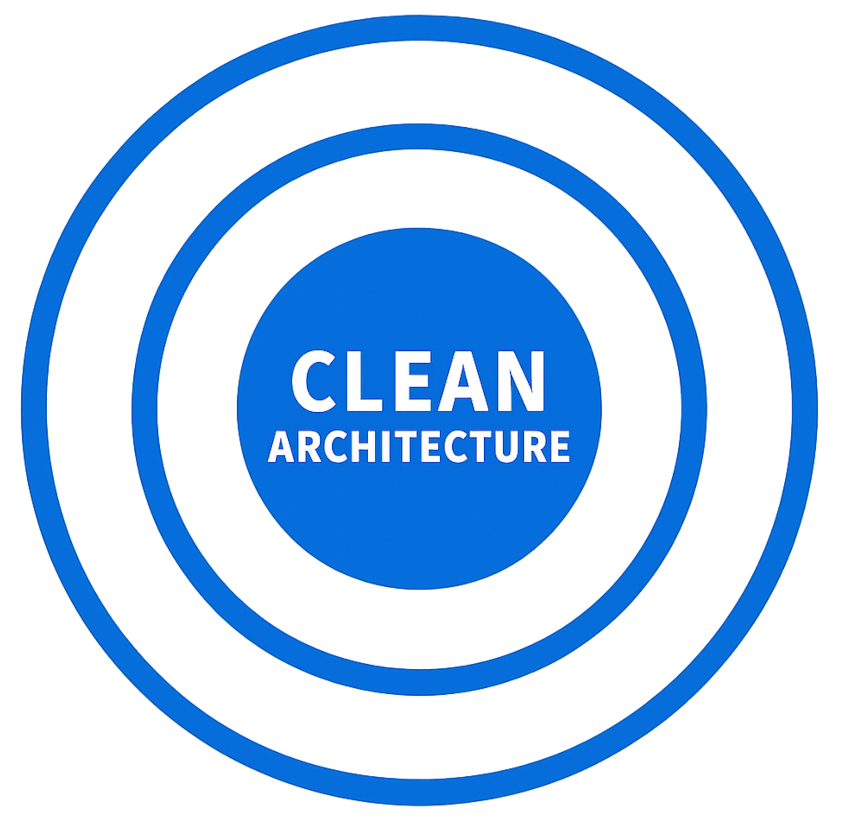
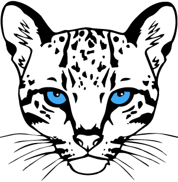
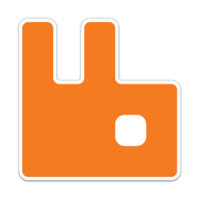
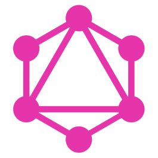
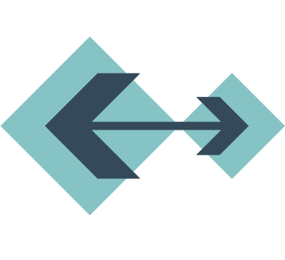
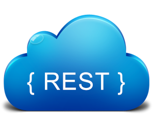
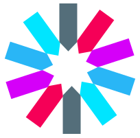
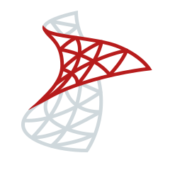
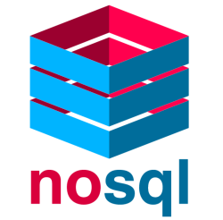

<h2>
  
  &nbsp; Hi there, I'm Hamed.   
   I conduct research in the fields of Software-Architecture,  
  WebAPI and Application-Developement.  
  💻 using C#.NET;  
   ⚔️ using vscode;  
</h2> 

`internal class Hamed<T> : IDamavandi, IDeveloper where T : People { Task Hi👋🏼(T you); }`

<h3>Coding Zones 🚧 </h3>

  
  
  
  
   
  
  
  
  
  
   
   
   
  
  
  
  
   
  
  
  
  
   
  
  
   
  
  
  
   
   
   
   
  

<table border="1">
  <tr>
    <td><b>C-Sharp ✦ .NET Ecosystem   Software Architectures ✦ Design Patterns   Backend ✦ API   Kernel ✦ Console   Databases   🌈 CSS</b></td>
    <td>   <b>⋄ Research Area</b></td>
  </tr>
</table>

  
  

