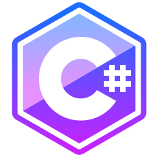

## 🚧 Coding Zones 🧐
💻 **C# ✦ .NET Core** 
⚔️ **Visual Studio Code**

|  |  |  |  |
|:---:|:---:|:---:|:---:|

|  |  |  |  |  |  |
|:---:|:---:|:---:|:---:|:---:|:---:|

|  |  |  |  |  |
|:---:|:---:|:---:|:---:|:---:|

|  |  |  |  |
|:---:|:---:|:---:|:---:|

|  |  |
|:---:|:---:|

|  |  |  |  |
|:---:|:---:|:---:|:---:|

|  |  |  |
|:---:|:---:|:---:|

| C-Sharp ✦ .NET Ecosystem   Architectures ✦ DesignPatterns   Backend ✦ API   Kernel ✦ Console   Databases   🌈 CSS |    Research Area |
|:---:|:---:|

 

  
  

