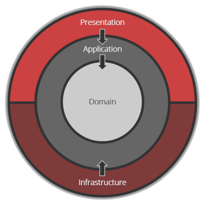

## 🚧 Coding Zones 🧐
💻 **C# ✦ .NET Core** 
⚔️ **Visual Studio Code**

 

 

     
   
     
    

| C-Sharp ✦ .NET Ecosystem   Architectures ✦ DesignPatterns   Backend ✦ API   Kernel ✦ Console   Databases   🌈 CSS |    Research Area |
|:---:|:---:|

  
  

